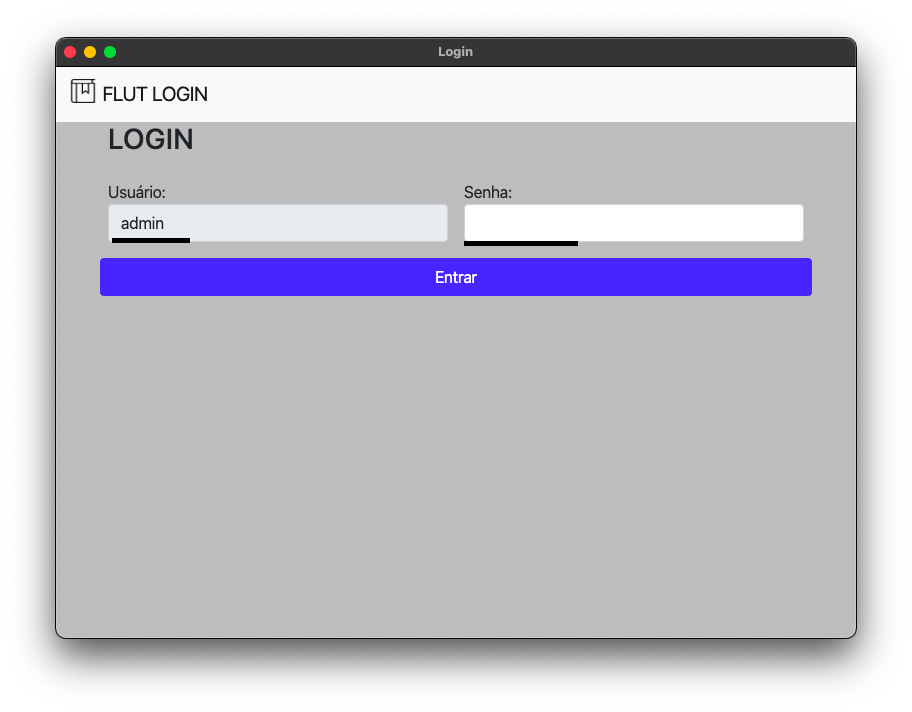
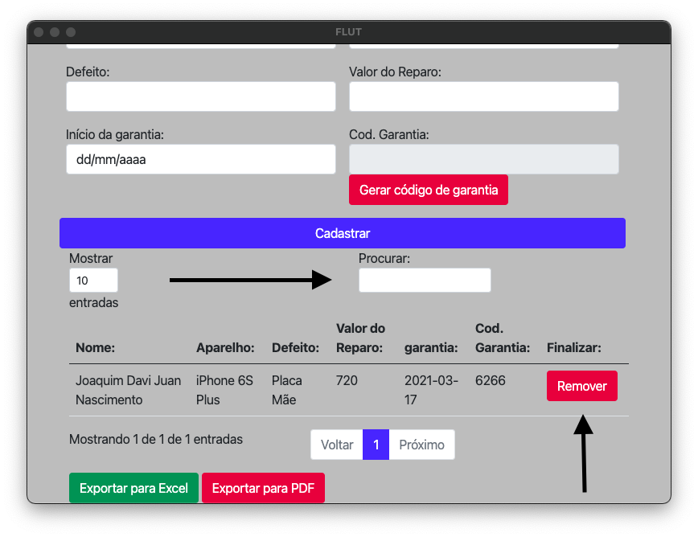
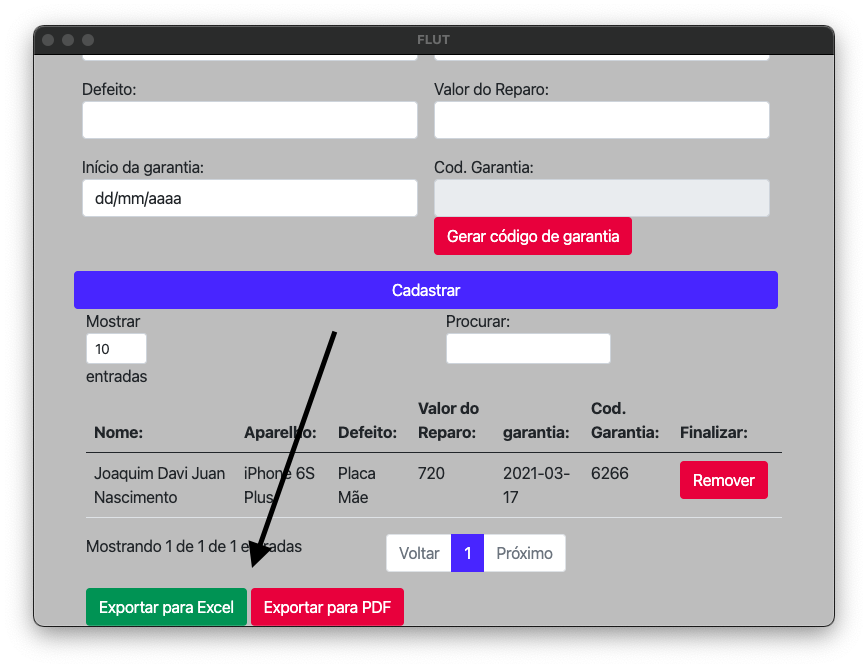
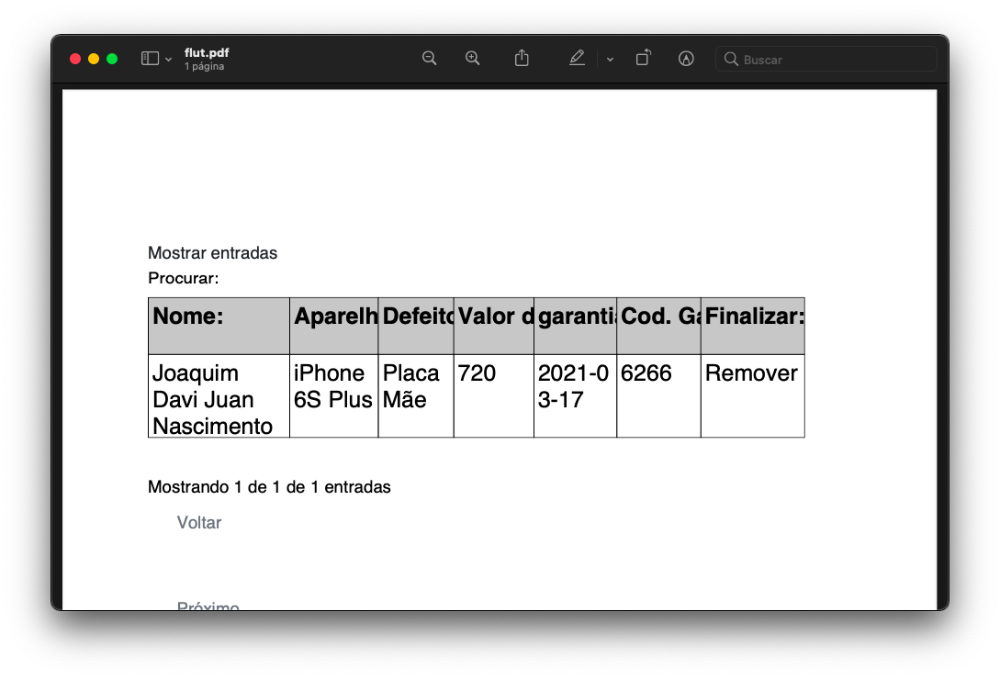
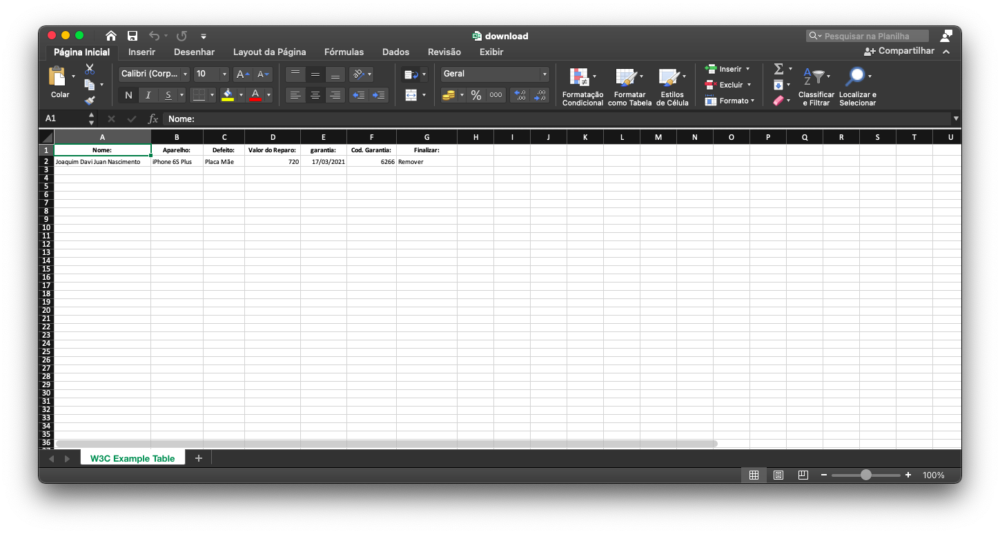

<h1>Bem vindo!</h1>
<h2>FLUT</h2>
créditos: Dário Jr

Flut é uma ferramenta multiplataforma (MacOS, Windows e Linux) para auxiliar no registro de cliente, acompanhamento da validade de garantia, registro de reparos e custos.

 
 
<h3>USO: </h3>

Instale o Flu

Insira a senha: admin na tela de login da aplicação.

Preencha os campos com os dados do cliente

Após o cadastro você pode procurar pelo redistro usando os dados inseridos.

Temos também a opção de exportar os registro para os formaros PDF ou XLS (Excel)

